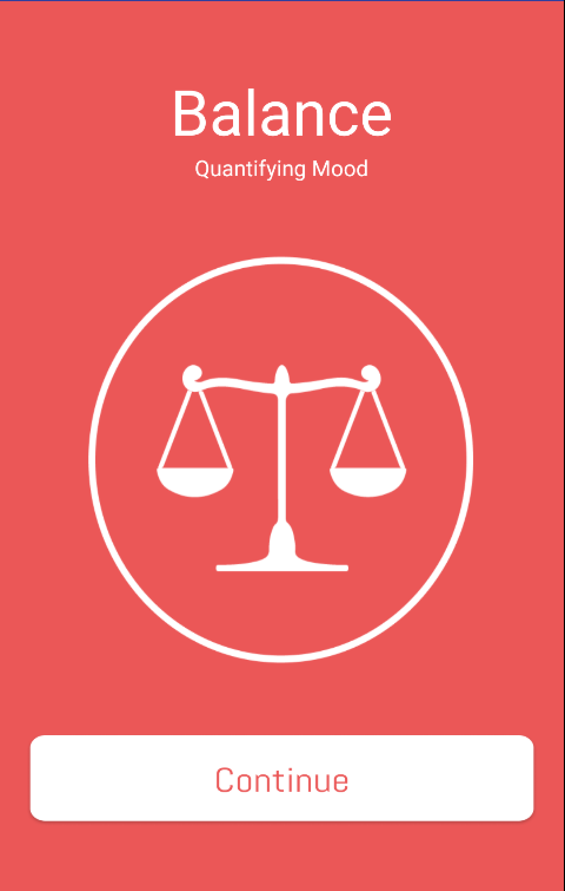
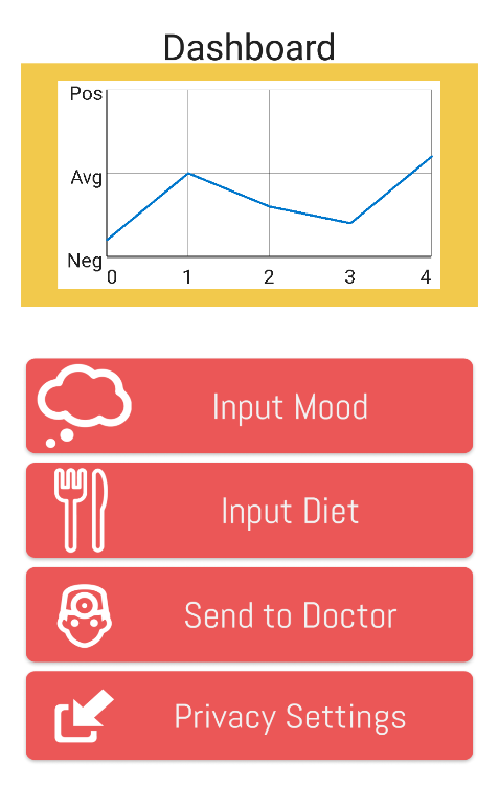
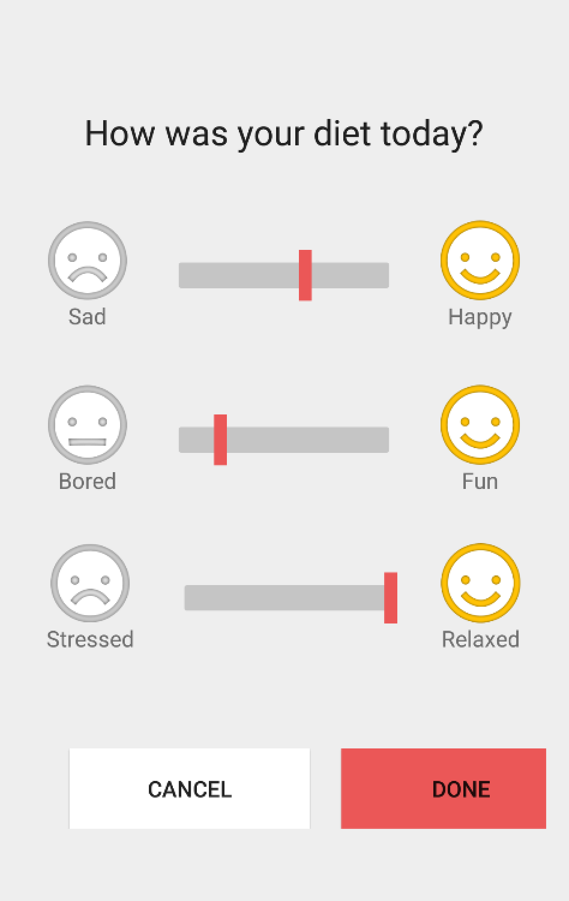
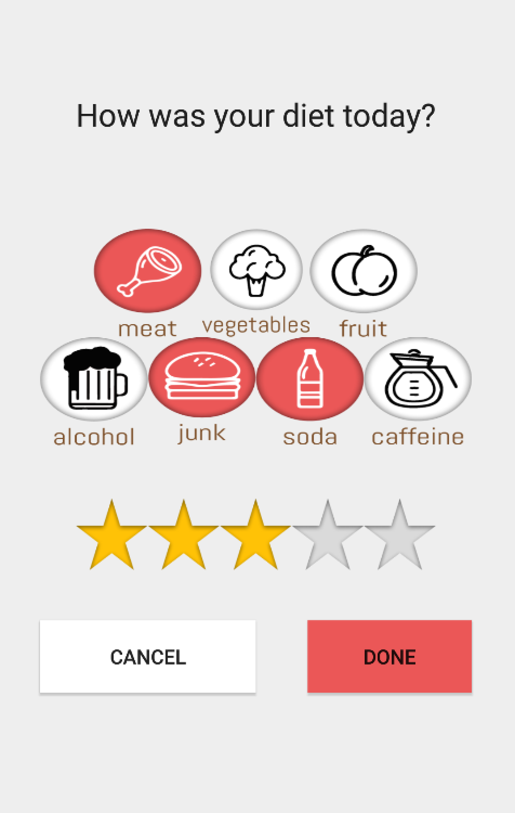
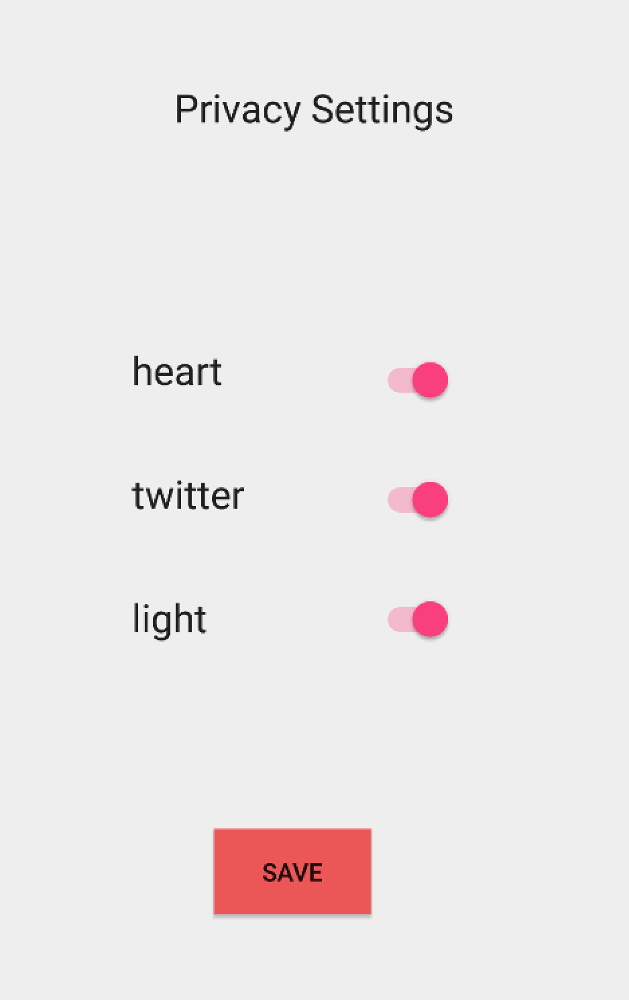
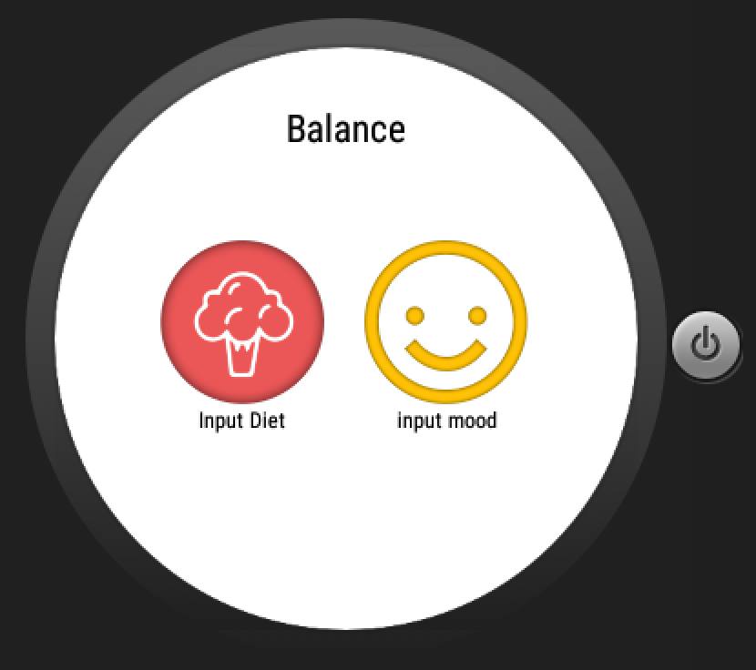
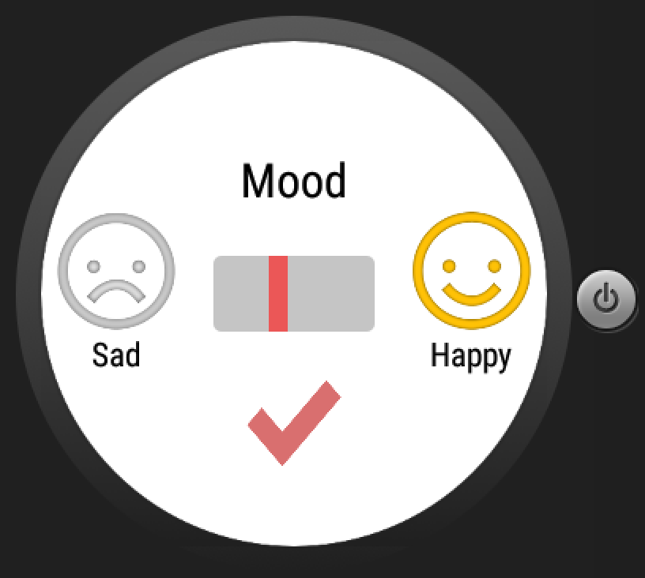
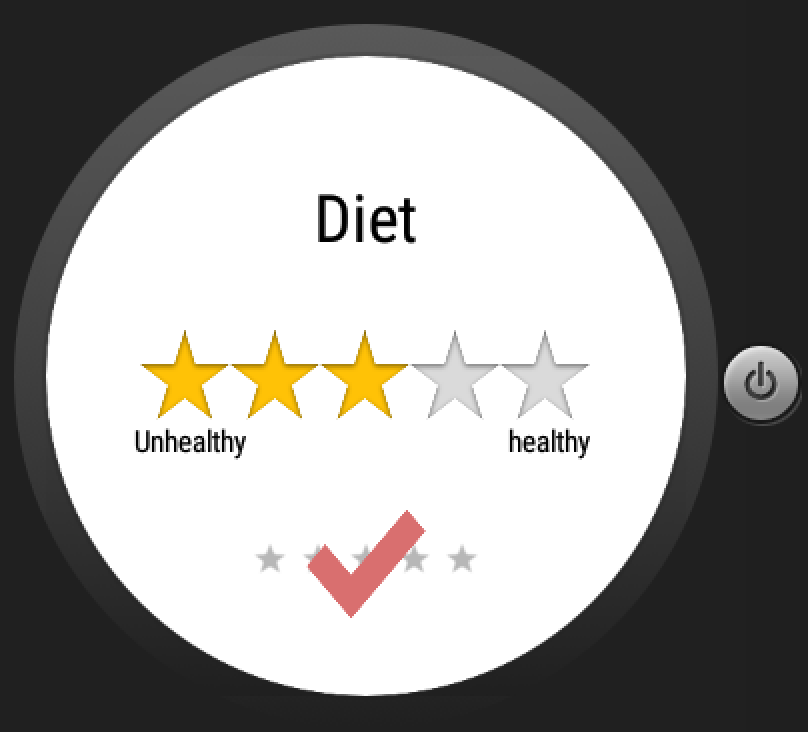

#Balance

An application for people with clinical depression to track their mood, diet, and send all of their recorded data to their medical professionals in seconds. 

## Authors

* Hashmi Hamza ([hhashmi@berkeley.edu](mailto:hhashmi@berkeley.edu))
* Daniel Dobalian ([ddobalian@berkeley.edu](mailto:ddobalian@berkeley.edu))
* Angela Kuo ([akuo5@berkeley.edu](mailto:akuo5@berkeley.edu))
* Kevin Baum ([hhashmi@berkeley.edu](mailto:hhashmi@berkeley.edu))
* Nicholas Adhyatama ([nicholasal@berkeley.edu](mailto:nicholasal@berkeley.edu))

## Presentation Slides

See [Balance] (https://docs.google.com/presentation/d/1ku-fHvK3feWplx1aaCN3--z3B1T6OJpElOybk-CJ4Gg/edit#slide=id.g12b7615f37_1_23)

## Screenshots

## Acknowledgments

* https://youtube.com/slidenerd
* http://stackoverflow.com/questions/10686209/attaching-a-pdf-to-an-email-from-android-app-file-size-is-zero
* http://www.codeproject.com/Articles/986574/Android-iText-Pdf-Example
* https://gist.github.com/mjohnsullivan/557c2f19ba177312b1d
* http://stackoverflow.com/questions/26489281/how-to-access-heart-rate-sensor-in-android-wearable
* http://stackoverflow.com/questions/24664217/get-heart-rate-from-sensor-samsung-gear-live
* http://developer.android.com/intl/es/reference/android/hardware/SensorListener.html
* https://gist.github.com/gabrielemariotti/d23bfe583e900a4f9276#file-myactivity-java
* http://developer.android.com/intl/es/guide/topics/sensors/sensors_overview.html
* http://stackoverflow.com/questions/25896481/heart-rate-sensor-api-for-android

# Additional Information
Welcome to Group 6's Project: Balance

Currently we have worked out a skeleton for our application!

Please checkout the other two branches to see our two features we are developing!

Thank you for your time. Hope you like it. Enjoy Balance.
